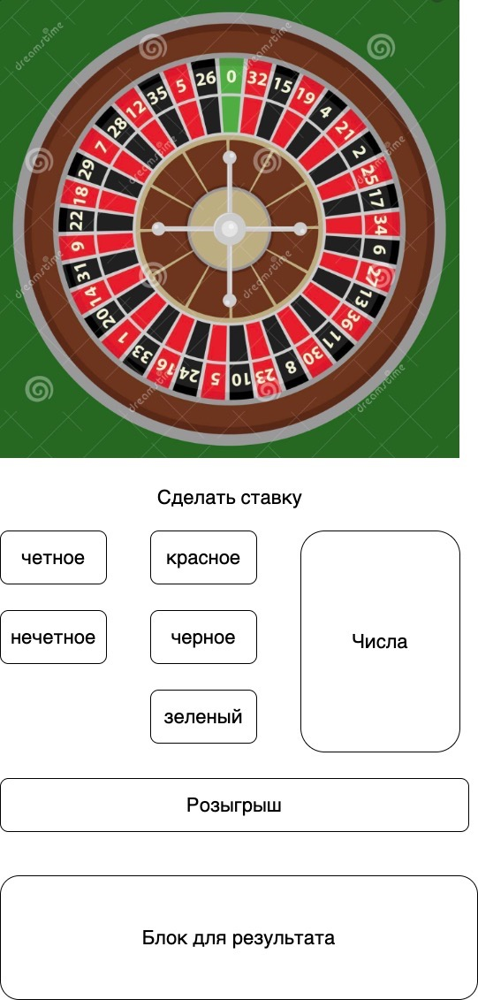

## Сценарий:

Вы решили создать Онлайн рулетку. Приложение должно быть анимировано и все состояния

Прототип для понимания (можно сделать по своему)  
​

### В приложении должны присутствовать такие функции как:

- **Возможность сделать ставку, выбирая число, кратность или цвет**
- **Возможность провести розыгрыш**
- **Желательно каждый шаг анимировать (выйграл - анимация победы)**

#### Необходимые знания:

- [Html5](http://htmlbook.ru/html5)
- [CSS](http://htmlbook.ru/css)
- [Canvas](https://www.w3schools.com/html/html5_canvas.asp)

Разрешено использовать любые сторонние библиотеки и фреймворки

#### Дополнительные баллы

* Анимация
* Приятный дизайн, удобный ux
* Адаптивная верстка
* Сохранение результатов в local storage, чтобы показывать таблицу участия

Если проект будет готов и в хорошем состоянии до окончания заявленого времени - разрешено добавлять собственные фичи, свистелки и дуделки.

#### Ожидаемый результат

- Рабочее приложение
- Исходный код должен быть предоставлен ссылкой на Git, Stash или Bitbucket репозиторий.
- Предоставить README файл в корневой папке проекта.
  * Общая информация о фичах и приложении в общем.
  * Необходимые команды чтобы запустить приложение
